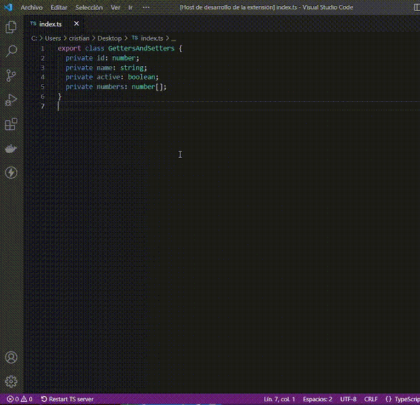

# Typescript getters and setters generator (TGSG)

A VSCode extension to automatically generate getters and setters for struct fields.

## How to use

1. Select a struct and some or all of its fields
2. Shift+CMD+P Select command & return

